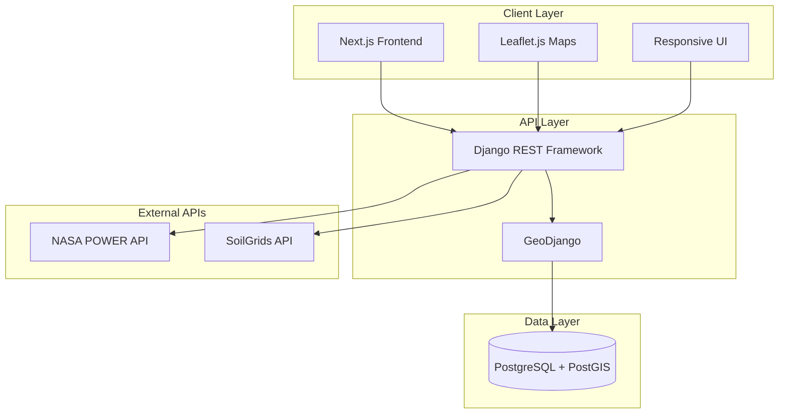

# Design Document

## Overview

Mlimi Wanzeru is a location-based agricultural advisory platform built for a 2-week geospatial computing class project. The system uses Django (Python), PostgreSQL with PostGIS, and Next.js to provide farmers with personalized recommendations for planting times and crop selection based on their location. The architecture is intentionally simplified to be achievable within the project timeline while demonstrating core geospatial computing concepts.

## Architecture

### System Architecture

The application follows a simplified three-tier architecture:

1. **Presentation Layer**: Next.js frontend with Tailwind CSS and Leaflet.js for mapping
2. **Application Layer**: Django REST Framework API with GeoDjango for spatial operations
3. **Data Layer**: PostgreSQL with PostGIS extension for spatial data storage and caching

### Component Diagram



### Data Flow

1. User selects location (district/village) in frontend
2. Frontend sends request to Django API with location parameters
3. Django queries PostGIS database for location coordinates
4. Django makes requests to external APIs (NASA POWER, SoilGrids)
5. Django caches API responses in PostgreSQL for 24 hours
6. Django performs spatial analysis using PostGIS functions
7. Results are serialized and returned to frontend
8. Frontend renders data on interactive maps and tables

## Components and Interfaces

### Frontend Components

#### LocationSelector Component

- **Purpose**: Allow users to select their district and village
- **Props**: `districts: District[]`, `onLocationChange: (location: Location) => void`
- **State**: `selectedDistrict`, `selectedVillage`, `villages`
- **Methods**:
  - `fetchVillages(districtId: string)`: Retrieves villages for selected district
  - `handleDistrictChange(districtId: string)`: Updates district selection
  - `handleVillageChange(villageId: string)`: Updates village and triggers location change

#### PlantingCalendar Component

- **Purpose**: Display optimal planting dates based on rainfall patterns
- **Props**: `location: Location`, `crops: Crop[]`
- **State**: `plantingWindows`, `selectedCrop`, `loading`
- **Methods**:
  - `fetchPlantingWindows(location: Location)`: Retrieves planting calendar data
  - `renderCalendar()`: Displays planting windows visually

#### CropSuitabilityMap Component

- **Purpose**: Interactive map showing crop suitability zones
- **Props**: `location: Location`, `selectedCrop: Crop`
- **State**: `mapCenter`, `suitabilityLayer`, `zoom`
- **Methods**:
  - `loadSuitabilityData(crop: Crop)`: Fetches suitability raster data
  - `renderHeatmap()`: Renders color-coded suitability zones
  - `handleMapClick(coordinates: [number, number])`: Shows point-specific data

### Backend Components

#### LocationService

- **Purpose**: Handle location queries and coordinate lookups
- **Methods**:
  - `get_districts()`: Returns all districts with boundaries
  - `get_villages(district_id)`: Returns villages in a district
  - `get_coordinates(village_id)`: Returns lat/lon for village
  - `get_location_by_point(lat, lon)`: Reverse geocoding to find district/village

#### WeatherService

- **Purpose**: Integrate with NASA POWER API for climate data
- **Methods**:
  - `fetch_rainfall_data(lat, lon, start_year, end_year)`: Retrieves historical rainfall
  - `calculate_planting_window(rainfall_data)`: Analyzes onset of rains
  - `get_cached_weather(location_key)`: Checks database cache first
  - `cache_weather_data(location_key, data, ttl)`: Stores in database cache table

#### SoilService

- **Purpose**: Integrate with SoilGrids API for soil properties
- **Methods**:
  - `fetch_soil_properties(lat, lon)`: Retrieves soil data
  - `parse_soil_response(response)`: Extracts relevant properties
  - `get_cached_soil(location_key)`: Checks cache
  - `cache_soil_data(location_key, data, ttl)`: Stores in cache

#### CropSuitabilityService

- **Purpose**: Calculate crop suitability scores
- **Methods**:
  - `calculate_suitability(crop, soil_data, elevation, climate)`: Computes score
  - `get_crop_requirements(crop_id)`: Returns ideal conditions for crop
  - `rank_crops(location)`: Returns all crops ranked by suitability
  - `generate_suitability_raster(crop, bounds)`: Creates map layer

#### SpatialDataService

- **Purpose**: Handle spatial data imports and processing
- **Methods**:
  - `import_boundaries(geojson_file)`: Imports administrative boundaries
  - `import_elevation(raster_file)`: Processes SRTM data
  - `validate_geometry(geometry)`: Ensures valid spatial data

### API Endpoints

#### Location Endpoints

- `GET /api/locations/districts/` - List all districts
- `GET /api/locations/districts/{id}/villages/` - List villages in district
- `GET /api/locations/villages/{id}/` - Get village details with coordinates
- `GET /api/locations/reverse/?lat={lat}&lon={lon}` - Reverse geocode

#### Agricultural Advisory Endpoints

- `GET /api/advisory/planting-calendar/?location={village_id}` - Get planting windows
- `GET /api/advisory/crop-suitability/?location={village_id}` - Get ranked crops
- `GET /api/advisory/crop-suitability-map/?crop={crop_id}&bounds={bbox}` - Get raster data

#### Data Management Endpoints (Admin)

- `POST /api/admin/import/boundaries/` - Import administrative boundaries
- `POST /api/admin/import/elevation/` - Import elevation data

## Data Models

### Location Models

```python
class District(models.Model):
    id = models.UUIDField(primary_key=True, default=uuid.uuid4)
    name = models.CharField(max_length=100)
    name_chichewa = models.CharField(max_length=100)
    boundary = models.MultiPolygonField(srid=4326)
    centroid = models.PointField(srid=4326)
    created_at = models.DateTimeField(auto_now_add=True)
    updated_at = models.DateTimeField(auto_now=True)

class Village(models.Model):
    id = models.UUIDField(primary_key=True, default=uuid.uuid4)
    name = models.CharField(max_length=100)
    name_chichewa = models.CharField(max_length=100)
    district = models.ForeignKey(District, on_delete=models.CASCADE)
    location = models.PointField(srid=4326)
    elevation = models.FloatField(null=True)
    created_at = models.DateTimeField(auto_now_add=True)
    updated_at = models.DateTimeField(auto_now=True)
```

### Agricultural Models

```python
class Crop(models.Model):
    id = models.UUIDField(primary_key=True, default=uuid.uuid4)
    name = models.CharField(max_length=100)
    name_chichewa = models.CharField(max_length=100)
    scientific_name = models.CharField(max_length=200)

    # Soil requirements
    min_ph = models.FloatField()
    max_ph = models.FloatField()
    min_clay_content = models.FloatField()  # percentage
    max_clay_content = models.FloatField()
    min_organic_carbon = models.FloatField()

    # Climate requirements
    min_rainfall = models.FloatField()  # mm per season
    max_rainfall = models.FloatField()
    min_temperature = models.FloatField()  # celsius
    max_temperature = models.FloatField()

    # Elevation requirements
    min_elevation = models.FloatField()  # meters
    max_elevation = models.FloatField()

    growing_season_days = models.IntegerField()
    created_at = models.DateTimeField(auto_now_add=True)
    updated_at = models.DateTimeField(auto_now=True)

class PlantingWindow(models.Model):
    id = models.UUIDField(primary_key=True, default=uuid.uuid4)
    village = models.ForeignKey(Village, on_delete=models.CASCADE)
    crop = models.ForeignKey(Crop, on_delete=models.CASCADE)
    start_date = models.DateField()
    end_date = models.DateField()
    confidence_level = models.FloatField()  # 0-1
    calculated_at = models.DateTimeField(auto_now=True)
```

### Cache Models

```python
class WeatherCache(models.Model):
    location_key = models.CharField(max_length=100, unique=True)
    latitude = models.FloatField()
    longitude = models.FloatField()
    data = models.JSONField()
    cached_at = models.DateTimeField(auto_now=True)
    expires_at = models.DateTimeField()

class SoilCache(models.Model):
    location_key = models.CharField(max_length=100, unique=True)
    latitude = models.FloatField()
    longitude = models.FloatField()
    data = models.JSONField()
    cached_at = models.DateTimeField(auto_now=True)
    expires_at = models.DateTimeField()
```

## Correctness Properties

_A property is a characteristic or behavior that should hold true across all valid executions of a system-essentially, a formal statement about what the system should do. Properties serve as the bridge between human-readable specifications and machine-verifiable correctness guarantees._

### Property Reflection

After analyzing all acceptance criteria, several properties were identified as redundant or overlapping:

- Language display properties (7.2 and 7.3) can be combined into a single property about language-content mapping
- Output completeness properties follow similar patterns and can use generic validators
- The simplified scope (removing markets and agro-dealers) reduces the total number of properties significantly

The following properties represent the unique, non-redundant validation requirements for the 2-week project scope:

### Location Management Properties

**Property 1: District list completeness**
_For any_ request to list districts, the system should return all districts stored in the database with no duplicates
**Validates: Requirements 1.1**

**Property 2: Village-district association**
_For any_ district selection, all returned villages should belong to that district and no villages from that district should be excluded
**Validates: Requirements 1.2**

**Property 3: Location coordinate persistence**
_For any_ village selection, the stored user location coordinates should match the coordinates of the selected village
**Validates: Requirements 1.3**

**Property 4: Coordinate retrieval validity**
_For any_ village ID, the retrieved coordinates should be valid latitude (-90 to 90) and longitude (-180 to 180) values
**Validates: Requirements 1.4**

### Weather and Planting Properties

**Property 5: Weather API integration**
_For any_ valid location coordinates, the system should successfully retrieve rainfall data from NASA POWER API or return a clear error
**Validates: Requirements 2.1**

**Property 6: Rainfall analysis period**
_For any_ rainfall dataset, the analysis should process exactly ten years of historical data
**Validates: Requirements 2.2**

**Property 7: Planting window validity**
_For any_ rainfall analysis, the calculated planting window should have a start date before the end date and both dates should be within the calendar year
**Validates: Requirements 2.3, 2.4**

**Property 8: Confidence level bounds**
_For any_ planting window calculation, the confidence level should be between 0 and 1 inclusive
**Validates: Requirements 2.5**

### Soil and Crop Suitability Properties

**Property 9: Soil data retrieval**
_For any_ valid coordinates, the system should retrieve soil properties from SoilGrids API or return cached data
**Validates: Requirements 3.1**

**Property 10: Soil property completeness**
_For any_ soil data response, the parsed result should contain clay content, sand content, pH level, and organic carbon values
**Validates: Requirements 3.2**

**Property 11: Suitability score calculation**
_For any_ valid soil, elevation, and climate data, the system should calculate suitability scores for all crops in the database
**Validates: Requirements 3.4**

**Property 12: Crop ranking order**
_For any_ set of crop suitability scores, the returned list should be sorted in descending order by suitability score
**Validates: Requirements 3.5**

**Property 13: Crop result completeness**
_For any_ crop in the suitability results, the output should include suitability score, soil requirements, and elevation requirements
**Validates: Requirements 3.6**

### Map Visualization Properties

**Property 14: Map centering accuracy**
_For any_ user location, the displayed map center coordinates should match the user's location coordinates
**Validates: Requirements 4.1**

**Property 15: Color gradient mapping**
_For any_ suitability score between 0 and 100, the color mapping function should return a color between red (0) and green (100) on the gradient
**Validates: Requirements 4.2**

**Property 16: Map data consistency**
_For any_ selected crop, the suitability data displayed on the map should match the suitability scores for that specific crop
**Validates: Requirements 4.3**

### Data Import and Validation Properties

**Property 17: GeoJSON parsing correctness**
_For any_ valid GeoJSON file, the parser should create database objects that preserve the geometry and attributes from the source
**Validates: Requirements 5.1, 5.2**

**Property 18: Coordinate reference system validation**
_For any_ imported spatial data, the coordinate reference system should be WGS84 (EPSG:4326) or the import should fail with a clear error
**Validates: Requirements 5.4**

### Performance and Caching Properties

**Property 19: Mobile load time**
_For any_ critical content request on a simulated slow connection (3G), the response should complete within five seconds
**Validates: Requirements 6.3**

**Property 20: Mobile data optimization**
_For any_ API endpoint, the mobile response payload should be no larger than the desktop response payload
**Validates: Requirements 6.4**

**Property 21: Weather data caching**
_For any_ location, weather data retrieved from NASA POWER API should be cached and reused for subsequent requests within twenty-four hours
**Validates: Requirements 9.3**

**Property 22: API fallback behavior**
_For any_ weather data request when NASA POWER API is unavailable, the system should return cached data if available and include a staleness warning
**Validates: Requirements 9.4**

### Internationalization Properties

**Property 23: Language detection**
_For any_ request with a browser language header, the system should correctly identify the language preference
**Validates: Requirements 7.1**

**Property 24: Language-content mapping**
_For any_ supported language selection (Chichewa or English), all interface text should be displayed in the selected language
**Validates: Requirements 7.2, 7.3**

**Property 25: Language preference override**
_For any_ manual language selection, the displayed content should match the manually selected language regardless of browser preference
**Validates: Requirements 7.4**

**Property 26: Language preference persistence**
_For any_ language change, the preference should be stored and retrieved on subsequent visits
**Validates: Requirements 7.5**

### Spatial Query Properties

**Property 27: Distance calculation accuracy**
_For any_ two geographic points, the calculated distance should be non-negative and should match the geodesic distance within 1% error
**Validates: Requirements 8.2**

**Property 28: Point-in-polygon accuracy**
_For any_ point and polygon, the point-in-polygon query should correctly determine whether the point falls inside or outside the polygon
**Validates: Requirements 8.4**

**Property 29: Query performance monitoring**
_For any_ spatial query that exceeds two seconds, the system should log a performance warning
**Validates: Requirements 8.5**

### API Integration Properties

**Property 30: NASA POWER API parameter correctness**
_For any_ weather data request, the API call should include valid latitude and longitude parameters
**Validates: Requirements 9.1**

**Property 31: JSON parsing robustness**
_For any_ valid JSON response from NASA POWER API, the parser should successfully extract the data without errors
**Validates: Requirements 9.2**

**Property 32: Weather parameter extraction**
_For any_ weather data response, the system should extract precipitation, temperature, and solar radiation values
**Validates: Requirements 9.5**

## Error Handling

### API Error Handling

**NASA POWER API Errors:**

- Network timeout (30 seconds): Return cached data if available, otherwise display user-friendly error
- Invalid coordinates: Validate coordinates before making API call
- Rate limiting: Implement exponential backoff and queue requests
- Malformed response: Log error details and return cached data

**SoilGrids API Errors:**

- Network timeout (30 seconds): Return cached data if available
- Invalid coordinates: Validate before API call
- Service unavailable: Use cached data and display staleness warning
- Missing properties: Use default values and log warning

### Database Error Handling

**Connection Errors:**

- Connection timeout: Retry with exponential backoff up to 3 times
- Connection lost: Attempt reconnection and notify user

**Query Errors:**

- Invalid geometry: Validate geometries before insert/update
- Constraint violations: Return specific error messages to user

### Spatial Data Error Handling

**Import Errors:**

- Invalid GeoJSON: Validate schema before parsing, return detailed error
- Wrong CRS: Reject import and display required CRS (EPSG:4326)
- Corrupt raster file: Validate file integrity before processing
- Missing required fields: List missing fields in error message

**Query Errors:**

- Invalid coordinates: Validate lat/lon ranges before query
- Empty result set: Return empty array with appropriate message
- Geometry errors: Log error and return user-friendly message

### User Input Error Handling

**Validation Errors:**

- Missing required fields: Highlight fields and display specific messages
- Invalid date range: Display message "End date must be after start date"
- Invalid coordinates: Display message "Coordinates must be within Malawi"

### Frontend Error Handling

**Network Errors:**

- Request timeout: Display retry button
- No internet connection: Display offline message and cached data if available
- Server error (5xx): Display generic error and log details

**Map Errors:**

- Tile loading failure: Display fallback tiles or solid color
- Invalid geometry: Skip rendering and log error

## Testing Strategy

### Unit Testing

**Backend Unit Tests (Django/Python):**

- Test each service method in isolation with mocked dependencies
- Test model validation and constraints
- Test serializers for correct data transformation
- Test utility functions for coordinate conversion, distance calculation
- Test cache key generation and expiration logic
- Coverage target: 70% for business logic (achievable in 2 weeks)

**Frontend Unit Tests (Next.js/React):**

- Test component rendering with different props
- Test state management and hooks
- Test utility functions for data formatting
- Test API client methods with mocked responses
- Coverage target: 60% for components (achievable in 2 weeks)

### Property-Based Testing

**Testing Framework:** Use Hypothesis for Python backend tests

**Test Configuration:** Each property-based test should run a minimum of 100 iterations

**Property Test Tagging:** Each property-based test must include a comment with the format:
`# Feature: smart-farmer-platform, Property {number}: {property_text}`

**Priority Property Tests (for 2-week timeline):**

1. **Location Properties (Properties 1-4):**

   - Generate random district IDs and verify village associations
   - Generate random coordinates and verify validity
   - Test coordinate persistence with random village selections

2. **Weather Properties (Properties 5-8):**

   - Generate random valid coordinates and test API integration
   - Generate random rainfall datasets and verify analysis
   - Test planting window calculations with varied rainfall patterns
   - Verify confidence levels are always in valid range

3. **Soil and Crop Properties (Properties 9-13):**

   - Generate random coordinates and test soil data retrieval
   - Test soil property extraction with varied API responses
   - Generate random soil/elevation/climate data and verify suitability calculations
   - Test crop ranking with random suitability scores

4. **Spatial Properties (Properties 27-28):**

   - Test distance calculations with random coordinate pairs
   - Generate random points and polygons, verify point-in-polygon accuracy

5. **Caching Properties (Properties 21-22):**
   - Test cache hit/miss behavior with random locations
   - Verify cache expiration after 24 hours
   - Test fallback behavior when API is unavailable

### Integration Testing

**API Integration Tests:**

- Test complete flow from location selection to planting calendar display
- Test crop suitability calculation with real API calls (using test accounts)
- Test data import workflows end-to-end

**Database Integration Tests:**

- Test spatial queries with real PostGIS functions
- Test transaction handling and rollback

### Manual Testing (for 2-week timeline)

**User Workflows:**

- Complete farmer journey: location selection → planting calendar → crop suitability
- Admin workflow: data import → verification
- Mobile user workflow: location selection → map interaction

**Browser Testing:**

- Test on Chrome and Firefox (minimum)
- Test on mobile browser (Chrome Mobile)
- Test responsive behavior at different screen sizes

## Security Considerations

### Authentication and Authorization

- Admin endpoints require authentication via Django session
- Rate limiting on public API endpoints (100 requests per minute per IP)
- CORS configuration to allow only approved frontend domains

### Data Validation

- Validate all user inputs on both frontend and backend
- Sanitize inputs to prevent SQL injection (use Django ORM parameterized queries)
- Validate coordinate ranges before spatial queries
- Validate file uploads (type, size, content) before processing

### API Security

- Store API keys in environment variables, never in code
- Use HTTPS for all external API calls

### Database Security

- Use connection pooling with SSL
- Regular backups

## Deployment Architecture (Simplified for Class Project)

### Development Environment

**Local Development:**

- Django development server
- PostgreSQL with PostGIS (Docker container recommended)
- Next.js development server
- Environment variables in .env file

### Production/Demo Environment (Optional)

**Simple Deployment:**

- Single server deployment (e.g., DigitalOcean droplet or Heroku)
- Nginx as reverse proxy
- Gunicorn for Django
- PostgreSQL with PostGIS
- Static files served by Nginx

### Data Sources Setup

**Required Data:**

1. **Malawi Administrative Boundaries:**

   - Source: Humanitarian Data Exchange (HDX)
   - URL: https://data.humdata.org/dataset/cod-ab-mwi
   - Format: GeoJSON or Shapefile
   - Contains: District and sub-district boundaries

2. **Elevation Data:**

   - Source: SRTM via USGS EarthExplorer
   - URL: https://earthexplorer.usgs.gov/
   - Format: GeoTIFF
   - Resolution: 30m or 90m

3. **Crop Requirements Data:**
   - Source: Manual entry based on agricultural extension guidelines
   - Format: CSV or direct database entry
   - Contains: Soil, climate, and elevation requirements for common Malawian crops (maize, tobacco, groundnuts, beans, cassava, sweet potato)

## Project Timeline (2 Weeks)

### Week 1: Backend and Data Setup

**Days 1-2:**

- Set up Django project with GeoDjango
- Configure PostgreSQL with PostGIS
- Create database models
- Import administrative boundaries

**Days 3-4:**

- Implement location services
- Implement weather service with NASA POWER API integration
- Implement soil service with SoilGrids API integration
- Set up database caching

**Days 5-7:**

- Implement crop suitability calculations
- Create REST API endpoints
- Write unit tests for core services
- Import elevation data and crop requirements

### Week 2: Frontend and Integration

**Days 8-9:**

- Set up Next.js project
- Create location selector component
- Create planting calendar component
- Integrate with backend API

**Days 10-11:**

- Create crop suitability map component
- Implement Leaflet.js map with suitability layers
- Add language switching (English/Chichewa)
- Make responsive for mobile

**Days 12-13:**

- Integration testing
- Bug fixes
- Performance optimization
- Write property-based tests for critical paths

**Day 14:**

- Final testing
- Documentation
- Deployment (if required)
- Presentation preparation

## Future Enhancements (Post-Class)

1. **SMS Notifications:** Send planting reminders via SMS
2. **Farmer Profiles:** Allow farmers to save preferences
3. **Weather Forecasts:** Add 7-day forecast integration
4. **Offline Support:** Progressive Web App with offline capabilities
5. **Market Integration:** Add market and agro-dealer features when data becomes available
